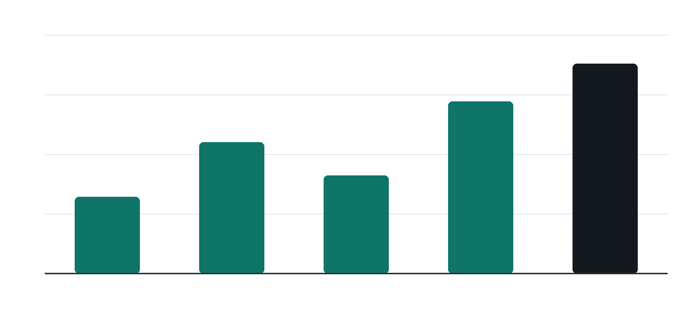

# Field Guide to Numerical Computing

Numerical computing sits at the intersection of mathematics and software engineering. Small errors compound, algorithms scale unevenly, and the difference between an elegant solution and a naive one is often measured in orders of magnitude. This guide walks through the practical considerations that recur across domains: floating-point behaviour, conditioning, iteration, and the pragmatics of shipping numerical code to production.

Every chapter is deliberately short. The goal is not to replace a textbook but to give the working engineer a map of the terrain, with enough signposts to know where the cliffs are. Read it in order, or jump to the chapter that matches the problem in front of you.

## 1. Floating-point arithmetic

Numerical computing sits at the intersection of mathematics and software engineering. Small errors compound, algorithms scale unevenly, and the difference between an elegant solution and a naive one is often measured in orders of magnitude. This guide walks through the practical considerations that recur across domains: floating-point behaviour, conditioning, iteration, and the pragmatics of shipping numerical code to production.

```text
0.1 + 0.2 == 0.3        ->  False
0.1 + 0.2 - 0.3         ->  5.551115123125783e-17
```

```python
from math import isclose

# Compare floats the sane way.
assert isclose(0.1 + 0.2, 0.3, rel_tol=1e-9)
```

The classic demonstration prints a surprise: sums that should cancel
leave a residue of the order of machine epsilon. This is not a bug in
the language. It is the expected consequence of a finite binary
representation, and every chapter that follows builds on it.

> In practice: measure first, then optimise. Numerical intuition is built from experiments, not from speculations.

## 2. Conditioning and stability

Numerical computing sits at the intersection of mathematics and software engineering. Small errors compound, algorithms scale unevenly, and the difference between an elegant solution and a naive one is often measured in orders of magnitude. This guide walks through the practical considerations that recur across domains: floating-point behaviour, conditioning, iteration, and the pragmatics of shipping numerical code to production.

```text
condition number k(A):  amplification of input error to output error
k ~ 1      ->  well-conditioned
k >> 1     ->  ill-conditioned, expect trouble
```

A stable algorithm applied to a well-conditioned problem gives answers
one can trust. An unstable algorithm applied to the same problem can
manufacture errors out of thin air, and no amount of extra precision
will save it.

> In practice: measure first, then optimise. Numerical intuition is built from experiments, not from speculations.

## 3. Iterative methods

Numerical computing sits at the intersection of mathematics and software engineering. Small errors compound, algorithms scale unevenly, and the difference between an elegant solution and a naive one is often measured in orders of magnitude. This guide walks through the practical considerations that recur across domains: floating-point behaviour, conditioning, iteration, and the pragmatics of shipping numerical code to production.

```python
def iterate(x0, step, tol=1e-12, max_iter=100):
    """Fixed-point iteration with a convergence guard."""
    x = x0
    for i in range(max_iter):
        nxt = step(x)
        if abs(nxt - x) < tol:
            return nxt, i
        x = nxt
    raise RuntimeError("iteration failed to converge")

root, steps = iterate(1.0, lambda x: (x + 2 / x) / 2)
assert abs(root * root - 2) < 1e-9
```

The guard matters. Without a cap on iterations, a diverging iteration
runs forever; without a tolerance, a converging one stops too early or
never stops at all.

> In practice: measure first, then optimise. Numerical intuition is built from experiments, not from speculations.

| Run | Task | Load | Status |
|-----|------|------|--------|
| 3.1 | Operation kk | 64% | done |
| 3.2 | Operation kkk | 67% | done |
| 3.3 | Operation k | 70% | done |
| 3.4 | Operation kk | 73% | done |
| 3.5 | Operation kkk | 76% | done |
| 3.6 | Operation k | 79% | done |
| 3.7 | Operation kk | 82% | done |
| 3.8 | Operation kkk | 85% | done |

## 4. Sparse linear algebra

Numerical computing sits at the intersection of mathematics and software engineering. Small errors compound, algorithms scale unevenly, and the difference between an elegant solution and a naive one is often measured in orders of magnitude. This guide walks through the practical considerations that recur across domains: floating-point behaviour, conditioning, iteration, and the pragmatics of shipping numerical code to production.

```python
def iterate(x0, step, tol=1e-12, max_iter=100):
    """Fixed-point iteration with a convergence guard."""
    x = x0
    for i in range(max_iter):
        nxt = step(x)
        if abs(nxt - x) < tol:
            return nxt, i
        x = nxt
    raise RuntimeError("iteration failed to converge")

root, steps = iterate(1.0, lambda x: (x + 2 / x) / 2)
assert abs(root * root - 2) < 1e-9
```

The guard matters. Without a cap on iterations, a diverging iteration
runs forever; without a tolerance, a converging one stops too early or
never stops at all.

> In practice: measure first, then optimise. Numerical intuition is built from experiments, not from speculations.

## 5. Interpolation and fitting

Numerical computing sits at the intersection of mathematics and software engineering. Small errors compound, algorithms scale unevenly, and the difference between an elegant solution and a naive one is often measured in orders of magnitude. This guide walks through the practical considerations that recur across domains: floating-point behaviour, conditioning, iteration, and the pragmatics of shipping numerical code to production.

```python
def iterate(x0, step, tol=1e-12, max_iter=100):
    """Fixed-point iteration with a convergence guard."""
    x = x0
    for i in range(max_iter):
        nxt = step(x)
        if abs(nxt - x) < tol:
            return nxt, i
        x = nxt
    raise RuntimeError("iteration failed to converge")

root, steps = iterate(1.0, lambda x: (x + 2 / x) / 2)
assert abs(root * root - 2) < 1e-9
```

The guard matters. Without a cap on iterations, a diverging iteration
runs forever; without a tolerance, a converging one stops too early or
never stops at all.

> In practice: measure first, then optimise. Numerical intuition is built from experiments, not from speculations.



Figure 1 — throughput by quarter, same chart as the reference document.

## 6. Quadrature and integration

Numerical computing sits at the intersection of mathematics and software engineering. Small errors compound, algorithms scale unevenly, and the difference between an elegant solution and a naive one is often measured in orders of magnitude. This guide walks through the practical considerations that recur across domains: floating-point behaviour, conditioning, iteration, and the pragmatics of shipping numerical code to production.

```text
condition number k(A):  amplification of input error to output error
k ~ 1      ->  well-conditioned
k >> 1     ->  ill-conditioned, expect trouble
```

A stable algorithm applied to a well-conditioned problem gives answers
one can trust. An unstable algorithm applied to the same problem can
manufacture errors out of thin air, and no amount of extra precision
will save it.

> In practice: measure first, then optimise. Numerical intuition is built from experiments, not from speculations.

| Run | Task | Load | Status |
|-----|------|------|--------|
| 6.1 | Operation kk | 25% | done |
| 6.2 | Operation kkk | 28% | done |
| 6.3 | Operation k | 31% | done |
| 6.4 | Operation kk | 34% | done |
| 6.5 | Operation kkk | 37% | done |
| 6.6 | Operation k | 40% | done |
| 6.7 | Operation kk | 43% | done |
| 6.8 | Operation kkk | 46% | done |

## 7. Optimisation basics

Numerical computing sits at the intersection of mathematics and software engineering. Small errors compound, algorithms scale unevenly, and the difference between an elegant solution and a naive one is often measured in orders of magnitude. This guide walks through the practical considerations that recur across domains: floating-point behaviour, conditioning, iteration, and the pragmatics of shipping numerical code to production.

```python
def iterate(x0, step, tol=1e-12, max_iter=100):
    """Fixed-point iteration with a convergence guard."""
    x = x0
    for i in range(max_iter):
        nxt = step(x)
        if abs(nxt - x) < tol:
            return nxt, i
        x = nxt
    raise RuntimeError("iteration failed to converge")

root, steps = iterate(1.0, lambda x: (x + 2 / x) / 2)
assert abs(root * root - 2) < 1e-9
```

The guard matters. Without a cap on iterations, a diverging iteration
runs forever; without a tolerance, a converging one stops too early or
never stops at all.

> In practice: measure first, then optimise. Numerical intuition is built from experiments, not from speculations.

## 8. Random numbers and Monte Carlo

Numerical computing sits at the intersection of mathematics and software engineering. Small errors compound, algorithms scale unevenly, and the difference between an elegant solution and a naive one is often measured in orders of magnitude. This guide walks through the practical considerations that recur across domains: floating-point behaviour, conditioning, iteration, and the pragmatics of shipping numerical code to production.

```python
def iterate(x0, step, tol=1e-12, max_iter=100):
    """Fixed-point iteration with a convergence guard."""
    x = x0
    for i in range(max_iter):
        nxt = step(x)
        if abs(nxt - x) < tol:
            return nxt, i
        x = nxt
    raise RuntimeError("iteration failed to converge")

root, steps = iterate(1.0, lambda x: (x + 2 / x) / 2)
assert abs(root * root - 2) < 1e-9
```

The guard matters. Without a cap on iterations, a diverging iteration
runs forever; without a tolerance, a converging one stops too early or
never stops at all.

> In practice: measure first, then optimise. Numerical intuition is built from experiments, not from speculations.

## 9. Performance and vectorisation

Numerical computing sits at the intersection of mathematics and software engineering. Small errors compound, algorithms scale unevenly, and the difference between an elegant solution and a naive one is often measured in orders of magnitude. This guide walks through the practical considerations that recur across domains: floating-point behaviour, conditioning, iteration, and the pragmatics of shipping numerical code to production.

```python
def iterate(x0, step, tol=1e-12, max_iter=100):
    """Fixed-point iteration with a convergence guard."""
    x = x0
    for i in range(max_iter):
        nxt = step(x)
        if abs(nxt - x) < tol:
            return nxt, i
        x = nxt
    raise RuntimeError("iteration failed to converge")

root, steps = iterate(1.0, lambda x: (x + 2 / x) / 2)
assert abs(root * root - 2) < 1e-9
```

The guard matters. Without a cap on iterations, a diverging iteration
runs forever; without a tolerance, a converging one stops too early or
never stops at all.

> In practice: measure first, then optimise. Numerical intuition is built from experiments, not from speculations.

| Run | Task | Load | Status |
|-----|------|------|--------|
| 9.1 | Operation kk | 76% | done |
| 9.2 | Operation kkk | 79% | done |
| 9.3 | Operation k | 82% | done |
| 9.4 | Operation kk | 85% | done |
| 9.5 | Operation kkk | 88% | done |
| 9.6 | Operation k | 91% | done |
| 9.7 | Operation kk | 94% | done |
| 9.8 | Operation kkk | 97% | done |

## 10. Testing numerical code

Numerical computing sits at the intersection of mathematics and software engineering. Small errors compound, algorithms scale unevenly, and the difference between an elegant solution and a naive one is often measured in orders of magnitude. This guide walks through the practical considerations that recur across domains: floating-point behaviour, conditioning, iteration, and the pragmatics of shipping numerical code to production.

```python
def iterate(x0, step, tol=1e-12, max_iter=100):
    """Fixed-point iteration with a convergence guard."""
    x = x0
    for i in range(max_iter):
        nxt = step(x)
        if abs(nxt - x) < tol:
            return nxt, i
        x = nxt
    raise RuntimeError("iteration failed to converge")

root, steps = iterate(1.0, lambda x: (x + 2 / x) / 2)
assert abs(root * root - 2) < 1e-9
```

The guard matters. Without a cap on iterations, a diverging iteration
runs forever; without a tolerance, a converging one stops too early or
never stops at all.

> In practice: measure first, then optimise. Numerical intuition is built from experiments, not from speculations.

## Appendix — regression matrix

The table below is intentionally long enough to span pages. The header row repeats on every page and rows never split.

| # | Case | Code | Ratio | Result |
|---|------|------|-------|--------|
| 001 | B1 | 007 | 1.618 | pass |
| 002 | C2 | 014 | 3.236 | pass |
| 003 | D3 | 021 | 4.854 | retry |
| 004 | E4 | 028 | 6.472 | pass |
| 005 | F5 | 035 | 8.090 | pass |
| 006 | G6 | 042 | 9.708 | retry |
| 007 | H7 | 049 | 11.326 | pass |
| 008 | I8 | 056 | 12.944 | pass |
| 009 | J9 | 063 | 14.562 | retry |
| 010 | K10 | 070 | 16.180 | pass |
| 011 | L11 | 077 | 17.798 | pass |
| 012 | M12 | 084 | 19.416 | retry |
| 013 | N13 | 091 | 21.034 | pass |
| 014 | O14 | 098 | 22.652 | pass |
| 015 | P15 | 105 | 24.270 | retry |
| 016 | Q16 | 112 | 25.888 | pass |
| 017 | R17 | 119 | 27.506 | pass |
| 018 | S18 | 126 | 29.124 | retry |
| 019 | T19 | 133 | 30.742 | pass |
| 020 | U20 | 140 | 32.360 | pass |
| 021 | V21 | 147 | 33.978 | retry |
| 022 | W22 | 154 | 35.596 | pass |
| 023 | X23 | 161 | 37.214 | pass |
| 024 | Y24 | 168 | 38.832 | retry |
| 025 | Z25 | 175 | 40.450 | pass |
| 026 | A26 | 182 | 42.068 | pass |
| 027 | B27 | 189 | 43.686 | retry |
| 028 | C28 | 196 | 45.304 | pass |
| 029 | D29 | 203 | 46.922 | pass |
| 030 | E30 | 210 | 48.540 | retry |
| 031 | F31 | 217 | 50.158 | pass |
| 032 | G32 | 224 | 51.776 | pass |
| 033 | H33 | 231 | 53.394 | retry |
| 034 | I34 | 238 | 55.012 | pass |
| 035 | J35 | 245 | 56.630 | pass |
| 036 | K36 | 252 | 58.248 | retry |
| 037 | L37 | 259 | 59.866 | pass |
| 038 | M38 | 266 | 61.484 | pass |
| 039 | N39 | 273 | 63.102 | retry |
| 040 | O40 | 280 | 64.720 | pass |
| 041 | P41 | 287 | 66.338 | pass |
| 042 | Q42 | 294 | 67.956 | retry |
| 043 | R43 | 301 | 69.574 | pass |
| 044 | S44 | 308 | 71.192 | pass |
| 045 | T45 | 315 | 72.810 | retry |
| 046 | U46 | 322 | 74.428 | pass |
| 047 | V47 | 329 | 76.046 | pass |
| 048 | W48 | 336 | 77.664 | retry |
| 049 | X49 | 343 | 79.282 | pass |
| 050 | Y50 | 350 | 80.900 | pass |
| 051 | Z51 | 357 | 82.518 | retry |
| 052 | A52 | 364 | 84.136 | pass |
| 053 | B53 | 371 | 85.754 | pass |
| 054 | C54 | 378 | 87.372 | retry |
| 055 | D55 | 385 | 88.990 | pass |
| 056 | E56 | 392 | 90.608 | pass |
| 057 | F57 | 399 | 92.226 | retry |
| 058 | G58 | 406 | 93.844 | pass |
| 059 | H59 | 413 | 95.462 | pass |
| 060 | I60 | 420 | 97.080 | retry |

## Colophon

This document was typeset from Markdown. The body face is IBM Plex Sans, code is set in IBM Plex Mono, and the whole file is A4 with a single accent colour. Good typography is invisible; bad typography is not. 🖨
