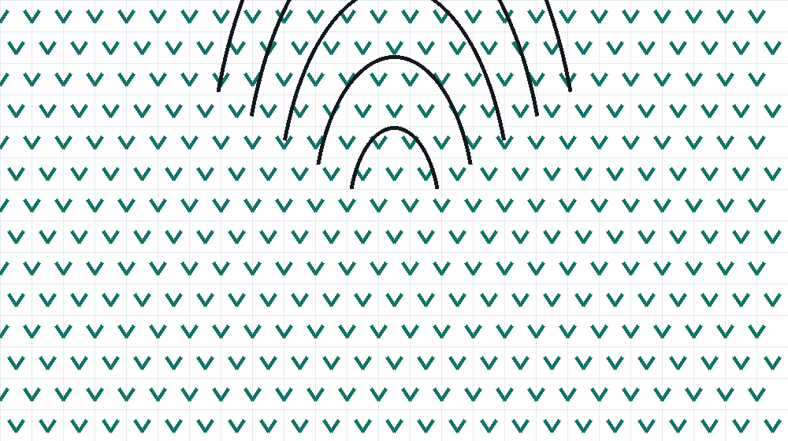

# Pixel the Axolotl

Meet Pixel, a smiling axolotl who fits in your palm. The pattern uses
basic stitches and works up in an afternoon. Finished size is about
14 cm from nose to tail.



## Materials

| Notion | Specification |
|--------|---------------|
| Yarn   | Sport weight cotton, ~50 g in pink, plus scraps of white and black |
| Hook   | 2.5 mm (C/2) |
| Safety eyes | 8 mm pair |
| Filling | Polyester fibrefill |
| Needle | Tapestry needle for closing |

## Stitches and abbreviations

- `ch` — chain
- `sc` — single crochet
- `inc` — increase (2 sc in one stitch)
- `dec` — decrease (2 sc together)
- `sl st` — slip stitch

Gauge is not critical for a toy, but keep it tight: stuffing should
not show through the fabric.

## Head and body

Worked in continuous rounds; mark the first stitch of every round.

1. Start with a magic ring of 6 sc (6)
2. `inc` six times (12)
3. `sc`, `inc` around (18)
4. `sc` 2, `inc` around (24)
5. Work 4 plain rounds (24)
6. `sc` 2, `dec` around (18)
7. Attach the eyes between rounds 5 and 6, 7 stitches apart
8. `sc`, `dec` around (12)
9. Stuff firmly, then `dec` six times (6)

> Tip — place the safety eyes before stuffing. Once the head is
> filled, the fabric resists the washers and your fingers will thank
> you.

## Legs (make four)

1. Magic ring of 6 sc (6)
2. Work 3 plain rounds (6)
3. Flatten and close with 3 sc across the opening

Sew the legs to the body so the axolotl rests flat on the table.

## Tail fan

The signature frills are worked flat, then joined.

```text
Row 1: ch 12, turn
Row 2: sc in the 2nd chain from the hook and across (11)
Row 3: ch 1, dec, sc 7, dec (9)
Row 4: ch 1, sc across (9)
```

Fasten off, leaving a long tail for sewing. Attach the fan behind the
last decrease round so it drapes over the body.

## Finishing

- Weave in all ends with the tapestry needle
- Embroider a small smile one round below the eyes
- Optional: a pinch of blush on the cheeks

Happy stitching! 🧶🪡
